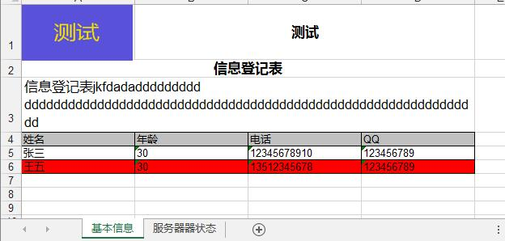

# XLSWriter

以列表的形式对 excel 追加数据，更方便的编写 xls 文件的库文件，比如导出报表的时候

<!-- vim-markdown-toc GFM -->

* [1 XLSWriter 使用](#1-xlswriter-使用)
    * [1.1 术语](#11-术语)
    * [1.2 使用](#12-使用)
* [2 使用 XLSWriter 的程序](#2-使用-xlswriter-的程序)
* [3 版本发布](#3-版本发布)
* [4 小额捐款](#4-小额捐款)

<!-- vim-markdown-toc -->

## 1 XLSWriter 使用
### 1.1 术语

```
行 Row
列 Column
```
### 1.2 使用
```
#git clone https://github.com/meetbill/XLSWriter.git
#cd XLSWriter
#python XLSWriter.py
```
执行完程序后会在本目录生成 ceshi.xls 文件，如下图所示



[使用手册及二次开发](https://github.com/meetbill/XLSWriter/wiki)


## 2 使用 XLSWriter 的程序

在很多时候需要将结果输出到 excel 时会比较麻烦，以下程序中引用了 ***XLSWriter***

* [zabbix_manager](https://github.com/meetbill/zabbix_manager.git)


## 3 版本发布

* v1.0.4，2017-07-21</br>
  -------------------- 修改：big_head 函数可以设置 logo 是否显示</br>
* v1.0.3，2016-06-14</br>
  -------------------- 新增：tile 自动居中，同时加粗</br>
  -------------------- 新增：表格可以自定义是否加背景色</br>
  -------------------- 新增：表格可以自定义表格宽度
* v1.0.2，2016-06-13</br>
  -------------------- 新增：可添加 xls 表头 logo</br>
  -------------------- 新增：输入内容时可以选择是否添加边框 </br>
  -------------------- 新增：表头合并表格并加标题
* v1.0.1，2016-02-13</br>
  -------------------- 新增：发布初始版本

## 4 小额捐款

如果你觉得 XLSWriter 对你有帮助，可以对作者进行小额捐款（支付宝）


